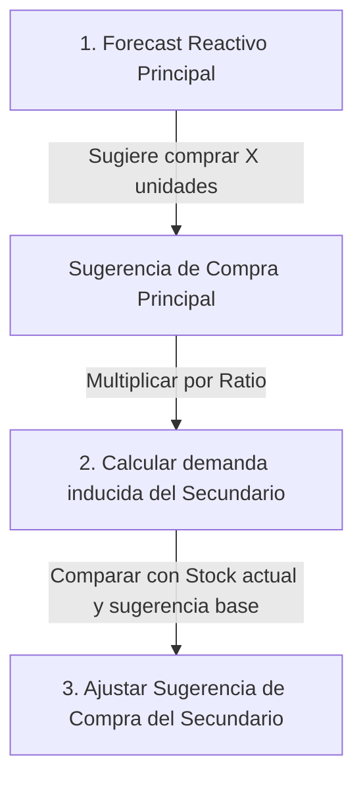

# Especificación Técnica: Dependencias de Reactivos/Kits y Forecast por Correlación

Este documento detalla el diseño de base de datos, la lógica de cálculo y la experiencia de usuario (UX) para resolver los cuellos de botella en el stock de reactivos clínicos mediante dependencias de productos y compras correlacionadas.

---

## 1. Concepto Central: Cuellos de Botella y Correlación

En un laboratorio clínico, los insumos no se consumen de manera aislada:
* El **Reactivo Principal** (ej. *Kit ELISA VIH*) requiere de **Insumos Secundarios / Diluyentes** (ej. *Buffer de Lavado VIH*, *Puntas de Pipeta*) para poder procesar las muestras.
* Si el stock de *Buffer de Lavado* se agota, las cajas de *Kit ELISA VIH* físicas en bodega quedan inutilizadas (stock bloqueado operativamente).
* Al sugerir compras, si el algoritmo sugiere adquirir 10 cajas de reactivos, debe sugerir automáticamente la cantidad correspondiente de buffers/diluyentes para evitar quiebres por desbalance.

---

## 2. Modelo de Datos (`producto_dependencias`)

Para relacionar los productos, se introduce una tabla intermedia de relaciones jerárquicas:

```sql
CREATE TABLE public.producto_dependencias (
    id SERIAL PRIMARY KEY,
    producto_principal_id UUID NOT NULL REFERENCES public.productos(id) ON DELETE CASCADE,
    producto_secundario_id UUID NOT NULL REFERENCES public.productos(id) ON DELETE CASCADE,
    
    -- Cuántas unidades del secundario se consumen por cada unidad del principal
    -- Ej: 1 Caja de Reactivo Principal consume 2.0 botellas de Buffer Secundario
    cantidad_secundaria NUMERIC(12, 4) NOT NULL, 
    
    created_at TIMESTAMP WITH TIME ZONE DEFAULT NOW() NOT NULL,
    
    -- Restricciones
    CONSTRAINT unique_principal_secundario UNIQUE (producto_principal_id, producto_secundario_id),
    CONSTRAINT check_ids_diferentes CHECK (producto_principal_id <> producto_secundario_id),
    CONSTRAINT check_cantidad_positiva CHECK (cantidad_secundaria > 0)
);

-- Índices para optimizar consultas de stock cruzado
CREATE INDEX idx_dependencias_principal ON public.producto_dependencias (producto_principal_id);
CREATE INDEX idx_dependencias_secundario ON public.producto_dependencias (producto_secundario_id);
```

---

## 3. Algoritmo de Detección de Cuellos de Botella (Dashboard)

El stock "útil" o "real" de un reactivo principal está limitado por la disponibilidad de sus dependencias.

### Lógica de Cálculo (Backend / SQL)
Para cada producto principal $P$ con stock actual $S_P$, que depende de $N$ productos secundarios $S_i$ con un ratio $R_i$ (unidades de $S_i$ por cada unidad de $P$):

$$\text{Capacidad Máxima Soportada de } P \text{ por el insumo } S_i = \frac{\text{Stock de } S_i}{R_i}$$

$$\text{Stock Útil Real de } P = \min \left( S_P, \min_{i=1}^N \left( \frac{\text{Stock de } S_i}{R_i} \right) \right)$$

### Ejemplo Operativo:
* **Producto Principal:** *Kit Elisa VIH* (Stock Físico $S_P = 10$ Kits).
* **Dependencia 1:** *Buffer de Lavado* (Ratio $R_1 = 2.0$ botellas/Kit, Stock $S_1 = 4$ botellas).
* **Cálculo:**
  $$\text{Capacidad soportada} = \frac{4\text{ botellas}}{2.0\text{ botellas/Kit}} = 2\text{ Kits}$$
  $$\text{Stock Útil Real} = \min(10, 2) = 2\text{ Kits}$$
* **Resultado:** El laboratorio tiene 10 Kits físicos, pero **solo puede usar 2**. Hay un **desbalance crítico** de 8 Kits inoperativos por falta de Buffer.

### 📊 Alerta en el Dashboard
El sistema mostrará una tarjeta de alerta preventiva cuando el stock útil sea menor al stock físico:
> ⚠️ **Insumo Crítico Limitado por Accesorios**
> El producto **Kit Elisa VIH** (Hematología) tiene **10 Kits** físicos, pero solo **2 Kits** son utilizables por falta de **Buffer de Lavado VIH** (Stock actual: 4 botellas, requiere 20 botellas para cubrir el reactivo).

---

## 4. Compras y Forecast por Correlación

Actualmente, [forecast.rs](file:///home/vdev/desarrollo/Inventariomarzo-final/backend/src/services/forecast.rs) calcula la `cantidad_sugerida` de forma aislada. Con la optimización correlacionada, el proceso se ajusta automáticamente en cascada.



### Regla del Algoritmo de Forecast Correlacionado:
Al calcular las sugerencias de compra para un periodo de revisión:
1. **Calcular principal:** Se calcula la sugerencia de compra estándar para el producto principal $P$ para cubrir los días objetivo (ej: sugerencia = 15 unidades).
2. **Derivar demanda secundaria:** Para cada dependencia secundaria $S_i$:
   * Se determina el stock total objetivo requerido de $S_i$ para acompañar al principal:
     $$\text{Stock Objetivo Inducido del Secundario} = (\text{Stock Objetivo del Principal}) \times R_i$$
   * Se calcula la brecha de compra del secundario:
     $$\text{Sugerencia Ajustada de } S_i = \max(\text{Sugerencia Estándar de } S_i, \text{Stock Objetivo Inducido} - \text{Stock Disponible } S_i - \text{Ya pedido } S_i)$$
3. **Resultado:** Al generar una propuesta de Orden de Compra para el proveedor, el sistema añade automáticamente los diluyentes y consumibles en la proporción exacta para que la cobertura en días quede perfectamente balanceada.

---

## 5. Criterios de Aceptación de la UI/UX

* **Pestaña "Dependencias" en Catálogo:** Al editar un producto, permitir asociar insumos secundarios indicando la cantidad consumida por unidad base.
* **Dashboard Preventivo:** Visualizar de forma clara los "cuellos de botella" de stock clínico.
* **Sugerencia de Compras Coherente:** Al revisar solicitudes de compra, al añadir un reactivo principal, el sistema debe mostrar un botón/tooltip: *"Agregar insumos correlacionados sugeridos (ej: +3 Buffer de Lavado)"* para facilitar la compra conjunta con un solo click.
