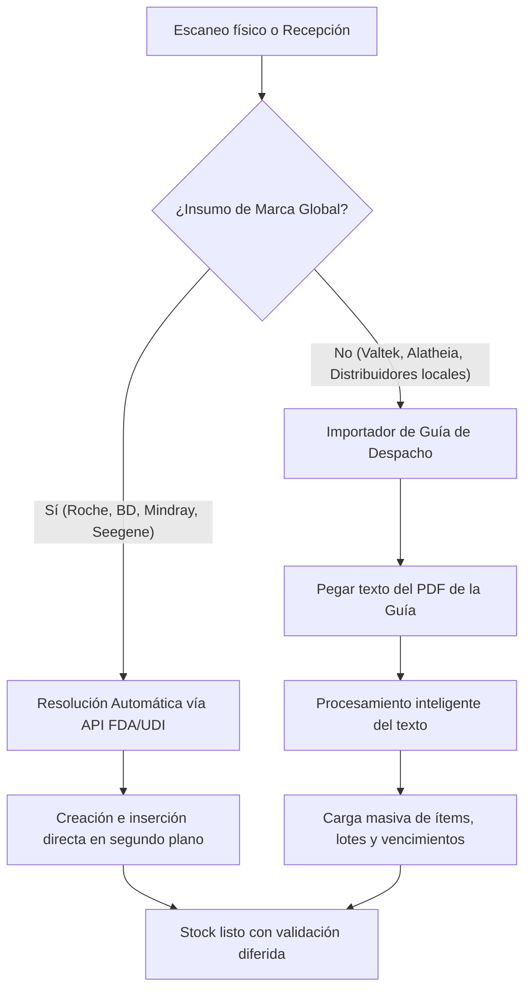

# Plan de Implementación: Catalogación de Insumos con Fricción Cero (Modelo Híbrido)

Este documento detalla las especificaciones de arquitectura y las etapas para implementar el **flujo de catalogación silenciosa** integrado con consultas a **APIs regulatorias de marcas globales** y un **importador de guías de despacho (PDF / Texto)** para distribuidores locales.

---

## 1. Flujo General del Sistema (Modelo Híbrido)

El sistema resolverá el ingreso de mercadería mediante dos canales complementarios para asegurar cero fricción:



---

## 2. Especificación Técnica por Componente

### 2.1 Módulo API de Marcas Globales (FDA AccessGUDID API)
Para marcas internacionales (**Roche, BD, Mindray, Seegene**), el backend implementará un servicio que consulta directamente la API pública de la FDA cuando se escanee un GTIN nuevo:

* **Servicio:** `backend/src/services/fda_service.rs`
* **API Endpoint Utilizada:** `https://accessgudid.nlm.nih.gov/api/v2/devices/lookup.json?di={GTIN}`
* **Comportamiento:** Si la API devuelve un resultado exitoso, el sistema extrae el `brandName` y crea el producto con `estado_catalogo = 'activo'`. El escaneo del usuario nunca se detiene.

### 2.2 Importador de Guías de Despacho (PDF / Texto)
Para marcas locales que no tienen API (**Valtek, Alatheia**), la recepción se facilitará mediante un cuadro de texto inteligente en el frontend:

* **Componente Frontend:** `ImportadorGuiaModal.tsx`
* **Flujo del Usuario:**
  1. El usuario hace clic en **"Importar Guía de Despacho (PDF)"**.
  2. Abre el PDF de la guía enviado por el proveedor, selecciona todo el texto (`Ctrl+A`), lo copia (`Ctrl+C`) y lo pega en el modal del sistema (`Ctrl+V`).
  3. El sistema envía este texto bruto a un endpoint del backend: `POST /api/v1/recepciones/parse-guia`.
* **Procesamiento en Backend:**
  El backend utiliza un servicio de análisis sintáctico inteligente (o una llamada ligera al LLM integrado en el sistema) para parsear el texto y extraer una estructura JSON:
  ```json
  [
    { "ref": "10300", "lote": "84171201", "vencimiento": "2026-05-31", "cantidad": 10 },
    { "ref": "98124", "lote": "9921AA", "vencimiento": "2025-12-31", "cantidad": 5 }
  ]
  ```
  El sistema valida los códigos REF contra la base de datos local y carga todos los registros en la lista de recepción con un solo clic.

### 2.3 Safeguard (El Resguardo de Calidad)
Si un producto se crea automáticamente durante el escaneo o la importación y no se encuentra su nombre formal:
* Se guarda con un nombre temporal: `[PENDIENTE] REF: {ref_code}`.
* Su propiedad `activo` se establece en `false` o `estado_catalogo = 'pendiente_aprobacion'`.
* **Bloqueo de Stock:** El stock físico ingresa al sistema, pero **queda bloqueado para consumo**. Los tecnólogos no pueden descontarlo en las pantallas de consumos diarios hasta que un supervisor valide la ficha técnica desde la **Bandeja de Catalogación**.

---

## 3. Plan de Trabajo e Hitos

### Hito 1: Base de Datos y Servicio FDA en Backend
* Crear las migraciones para añadir `estado_catalogo` y `origen_registro` a `productos`.
* Escribir el servicio `fda_service.rs` para consultas HTTP a la base de datos de la FDA.
* Modificar el endpoint `GET /api/v1/productos/scan` para integrar la búsqueda automática y creación en cascada.

### Hito 2: Parser de Guías de Despacho
* Crear el endpoint `POST /api/v1/recepciones/parse-guia` en Rust.
* Diseñar el algoritmo de extracción (o prompt del LLM) para procesar el texto bruto de la guía de despacho y devolver los campos clave (REF, lote, vencimiento, cantidad).

### Hito 3: Interfaz de Recepción e Importación en Frontend
* Crear el modal `ImportadorGuiaModal.tsx` en el módulo de recepciones.
* Integrar la importación por texto en el wizard de nueva recepción.
* Agregar indicadores visuales de "Producto Pendiente de Catalogación" en la lista de ítems.

### Hito 4: Bandeja de Catalogación y Reglas de Bloqueo
* Modificar el filtro de consumo de stock para ocultar los ítems con `estado_catalogo = 'pendiente_aprobacion'`.
* Construir la vista de administración para la aprobación masiva y actualización de fichas de productos pendientes.
