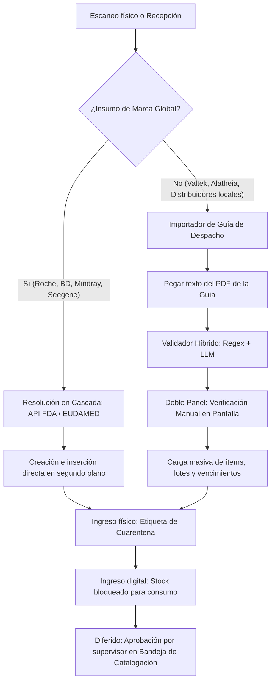

# Plan de Implementación: Catalogación de Insumos con Fricción Cero (Modelo Híbrido Avanzado)

Este documento detalla las especificaciones de arquitectura, seguridad y las etapas para implementar el **flujo de catalogación silenciosa** integrado con consultas a **APIs regulatorias internacionales** y un **importador inteligente de guías de despacho (PDF / Texto)** con mitigaciones contra errores físicos y digitales.

---

## 1. Arquitectura y Flujo de Datos

El sistema resolverá el ingreso de mercadería mediante dos canales automatizados, separando la figura del **Fabricante (Marca)** de la del **Proveedor (Distribuidor)** para permitir compras multi-canal.

---

## 2. Mitigación de Debilidades y Especificaciones Técnicas

### 2.1 Módulo API Internacional (FDA + EUDAMED)
Para marcas internacionales (**Roche, BD, Mindray, Seegene**), el backend implementará una consulta en cascada para evitar la limitación geográfica de la FDA:

* **Servicio:** `backend/src/services/api_regulatoria_service.rs`
* **Flujo de consulta:**
  1. Intentar consultar **FDA AccessGUDID API** (`https://accessgudid.nlm.nih.gov/api/v2/devices/lookup.json?di={GTIN}`).
  2. Si no hay coincidencia (debido a regionalización de códigos), consultar la API de **EUDAMED** (Unión Europea).
  3. Si falla la búsqueda por GTIN, buscar en el catálogo histórico local por coincidencia exacta del código **REF** (independiente del código de barras).

### 2.2 Importador de Guías (Validador Híbrido y Doble Panel)
Para evitar los riesgos de alucinación de datos críticos (como números de lote o fechas de vencimiento erróneas) provocado por procesar texto libre únicamente con IA, se utilizará una estrategia híbrida:

1. **Parser Híbrido (Backend):**
   * **Nivel 1 (Regex & Plantillas):** Si el texto proviene de un proveedor conocido (ej: *Valtek*), el sistema utiliza expresiones regulares rígidas para estructurar las columnas de forma matemática y 100% exacta.
   * **Nivel 2 (LLM Fallback):** Si el formato es desconocido, se utiliza un modelo de lenguaje para identificar y estructurar las columnas.
2. **Doble Panel de Verificación (Frontend):**
   * El modal `ImportadorGuiaModal.tsx` se divide en dos paneles: a la izquierda el texto bruto que pegó el usuario, y a la derecha la tabla de ítems parseada.
   * El sistema resalta en rojo/alerta si detecta fechas con formato inválido o lotes con caracteres sospechosos, obligando al usuario a validar visualmente antes de confirmar la carga masiva.

### 2.3 Separación de Entidades (Fabricante vs. Proveedor)
Para evitar que un insumo quede atado a un único canal de compra:
* **Entidad `Fabricante` (Marca original):** ej. *Roche, Valtek, BD, Mindray*.
* **Entidad `Proveedor` (Distribuidor que vende el insumo):** ej. *Alatheia, Roche Chile, Valtek Diagnostics*.
* El código **REF** de catálogo se asocia a la combinación de `Producto` + `Fabricante`. El mismo producto puede ser cotizado y comprado a diferentes distribuidores con precios unitarios distintos.

### 2.4 Resguardo de Stock en Cuarentena (Físico vs. Digital)
Para evitar que un operario almacene un insumo físicamente en las repisas y que los tecnólogos lo consuman antes de que el supervisor lo catalogue correctamente en el software:

* **Bloqueo en Base de Datos:** Los productos creados en caliente se registran con `estado_catalogo = 'pendiente_aprobacion'`. Las queries de consumo clínico filtran y ocultan este stock automáticamente.
* **Flujo Físico y Etiqueta de Alerta:**
  1. Al recibir un producto "Pendiente", el sistema genera de forma obligatoria una etiqueta con un código de barra de alerta que dice **"BLOQUEADO - EN CUARENTENA"**.
  2. El operario debe pegar la etiqueta sobre la caja y ubicarla físicamente en una zona delimitada del laboratorio (repisa de cuarentena).
  3. Una vez que el administrador valida el producto en el software, se imprime la etiqueta definitiva y el insumo se traslada a la estantería de uso diario.

---

## 3. Plan de Trabajo y Hitos de Desarrollo

### Hito 1: Modificaciones en Base de Datos y API en Cascada
* Agregar `estado_catalogo` y `origen_registro` a la tabla `productos`.
* Implementar `api_regulatoria_service.rs` en Rust con búsqueda secuencial FDA $\rightarrow$ EUDAMED $\rightarrow$ REF Histórico.
* Modificar el endpoint de escaneo para crear borradores con estado `pendiente_aprobacion`.

### Hito 2: Parser Híbrido de Guías de Despacho
* Crear el endpoint `POST /api/v1/recepciones/parse-guia`.
* Escribir las expresiones regulares para los principales proveedores locales y la lógica de procesamiento de texto bruto.

### Hito 3: Interfaz de Recepción y Panel de Verificación
* Crear el modal `ImportadorGuiaModal.tsx` con el diseño de doble panel (texto vs. tabla).
* Implementar la impresión de etiquetas temporales de cuarentena.

### Hito 4: Módulo de Aprobación y Reglas de Bloqueo
* Asegurar que el stock en cuarentena esté oculto en el flujo de consumos.
* Crear la bandeja de catalogación para la aprobación de insumos pendientes.
