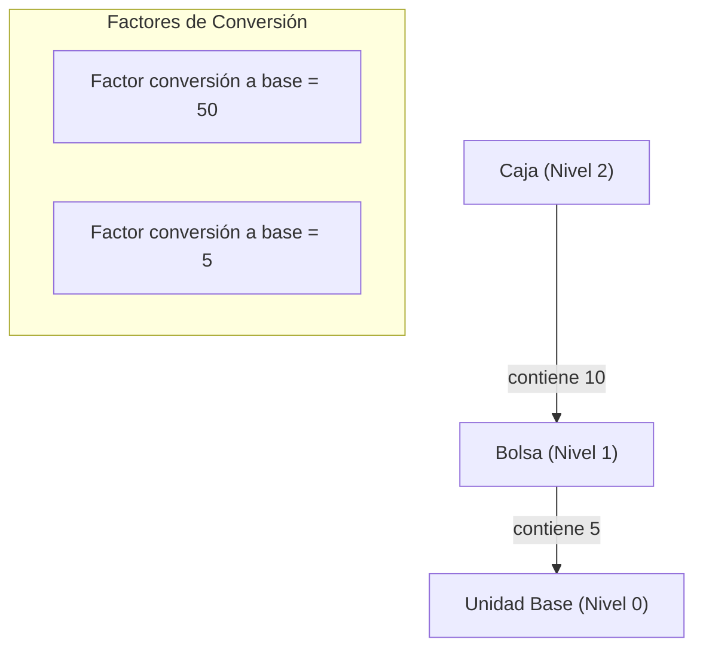

# Propuesta Técnica: Optimización de Recepción y Catalogación
## Conteo Físico, Jerarquía de Packaging y Rediseño de Cuarentena

Este documento presenta un análisis de código, benchmark con la competencia y propuestas técnicas detalladas para resolver tres dolores clave en el flujo de entrada de inventario en el laboratorio clínico:

1. **Conteo físico y conciliación** tras la importación masiva de guías de despacho (pistola, lector QR o manual).
2. **Jerarquía de empaque (Packaging)** para modelar cajas, bolsas y unidades (desglose y visualización multinivel).
3. **Optimización/Eliminación de la cuarentena automática** al recibir productos nuevos no catalogados.

---

## 1. Conteo Físico Post-Importación de Guía (Conciliación)

### 📌 Diagnóstico del Código Actual
* **Cómo funciona hoy:** En [ImportadorGuiaModal.tsx](file:///home/vdev/desarrollo/Inventariomarzo-final/frontend/src/components/shared/ImportadorGuiaModal.tsx#L287), la guía PDF se parsea y las cantidades del documento se asignan directamente al stock de recepción (`cantidad_presentacion: item.cantidad`).
* **El problema:** No existe distinción entre **"Cantidad Documental (Guía)"** y **"Cantidad Física (Recibida)"**. Si el operador modifica la cantidad porque llegó menos stock, la referencia de lo que declaraba la guía se pierde. Tampoco existe un flujo guiado para escanear y contar de forma interactiva.

### 🔍 Benchmark de Competencia
* **Sistemas WMS (Odoo, NetSuite):** Utilizan el concepto de *Reconciliation/Receiving Worksheet*. Al importar una guía de despacho o ASN (Advanced Shipping Notice), se genera una lista de verificación "ciega" o con cantidades esperadas. El operario escanea el código de barras físico del producto; cada escaneo incrementa la cantidad física. Si hay diferencias, se genera una alerta visual y un reporte de discrepancia para reclamar al proveedor.
* **Inventarios Genéricos (Sortly):** Permiten escaneo rápido para sumar stock, pero no comparan contra un documento de origen.

### 🛠️ Propuesta de Diseño Técnico

#### A. Modelo de Datos (Extensión en Frontend y Backend)
Mantener la trazabilidad del documento original agregando campos específicos en el detalle de la recepción:
* `cantidad_guia` (numeric, read-only): Cantidad declarada en la guía.
* `cantidad_fisica` (numeric, mutable): Cantidad realmente contada en bodega.
* `estado_conciliacion` (enum: `'ok' | 'faltante' | 'sobrante' | 'extra'`).

#### B. Interfaz de Usuario: "Modo Verificación / Conteo Físico"
1. **Paso Intermedio tras Importar:** Al confirmar la importación de la guía, los ítems se cargan en un nuevo **"Modo Conteo Físico"** dentro del wizard de recepción.
2. **Botón "Igualar todo con la guía":** Permite al usuario saltarse el conteo manual si confía en que todo llegó correcto, rellenando `cantidad_fisica = cantidad_guia`.
3. **Escaneo Incremental (Pistola/Lector QR/Cámara):**
   * Al escanear un GTIN o SKU, el sistema busca el ítem en la lista.
   * Si lo encuentra, incrementa `cantidad_fisica` en `+1` (o en el factor de la presentación escaneada).
   * **Retroalimentación Auditiva (Web Audio API):**
     * **Beep de Éxito (440Hz, 100ms):** El producto coincide y está dentro del límite de la guía.
     * **Buzz de Alerta/Error (150Hz, 300ms):** Producto no está en la guía, o se superó la cantidad declarada.
4. **Indicadores Visuales de Conciliación:**
   * ⚪ **Pendiente (Gris):** `cantidad_fisica == 0` (aún no se ha contado).
   * 🟢 **Correcto (Verde):** `cantidad_fisica == cantidad_guia` (Match perfecto).
   * 🟡 **Faltante (Amarillo/Naranja):** `cantidad_fisica < cantidad_guia` (Llegó de menos).
   * 🔴 **Sobrante (Rojo):** `cantidad_fisica > cantidad_guia` (Llegó de más).
5. **Cierre y Reporte:** Al finalizar, el sistema muestra el modal de reconciliación. Si existen discrepancias, obliga a ingresar una nota explicativa y guarda un log de diferencias en la base de datos para auditoría.

---

## 2. Jerarquía de Packaging (Caja ➡️ Bolsa ➡️ Unidad)

### 📌 Diagnóstico del Código Actual
* **Cómo funciona hoy:** En [presentacion.rs](file:///home/vdev/desarrollo/Inventariomarzo-final/backend/src/models/presentacion.rs), cada presentación tiene un `factor_conversion` independiente que relaciona la presentación directamente con la **unidad base**.
* **El problema:** No existe relación jerárquica entre presentaciones (ej. el sistema no sabe que una *Caja* contiene *Bolsas*, y que cada *Bolsa* contiene *Unidades*). Esto obliga al usuario a calcular manualmente cuántas unidades base hay en empaques complejos y dificulta el fraccionamiento de stock.

### 🔍 Benchmark de Competencia
* **Sistemas ERP/WMS (SAP, Odoo):** Implementan las "Unidades de Medida" (UoM) con relaciones lineales o agrupaciones (UoM Groups). Permiten definir que:
  * `1 Bolsa = 10 Unidades`
  * `1 Caja = 10 Bolsas` (calculando automáticamente que 1 Caja = 100 Unidades).
* **LIMS de Laboratorio Clínico:** Utilizan jerarquías para el desglose estricto de reactivos (kit -> vial -> alícuota) para mantener la cadena de custodia y control del volumen remanente.

### 🛠️ Propuesta de Diseño Técnico



#### A. Cambios en Base de Datos (`presentaciones`)
Agregar una referencia recursiva y un factor relativo para construir la jerarquía:
```sql
ALTER TABLE presentaciones 
ADD COLUMN parent_presentacion_id INTEGER REFERENCES presentaciones(id) ON DELETE SET NULL,
ADD COLUMN cantidad_unidades_padre NUMERIC(12,2) DEFAULT 1;
```
* **Ejemplo:**
  * **Presentación 1 (Bolsa):** `factor_conversion = 5`, `parent_presentacion_id = NULL` (hijo directo de la unidad base).
  * **Presentación 2 (Caja):** `factor_conversion = 50`, `parent_presentacion_id = 1` (Bolsa), `cantidad_unidades_padre = 10` (significa "viene de a 10 bolsas por caja").

#### B. Interfaz de Creación de Producto (UX Simplificada)
En lugar de forzar al usuario a calcular factores globales respecto a la unidad base:
1. Define la **Unidad Base** (ej. *Vial*).
2. Permite añadir niveles de empaque en cascada:
   * *"¿Cómo viene el empaque intermedio?"* ➡️ **Bolsa** con `5` *Viales*.
   * *"¿Cómo viene el empaque superior?"* ➡️ **Caja** con `10` *Bolsas*.
3. El sistema calcula automáticamente los factores absolutos para la base de datos (`factor_conversion` de la Caja = `10 * 5 = 50`).

#### C. Ingreso y Visualización Multicanal (Recepciones, Inventario y Desglose)
* **Ingreso Multinivel:** Al hacer inventario o recibir, el operario ve campos separados:
  `[ 2 ] Cajas` y `[ 4 ] Bolsas` y `[ 3 ] Viales` ➡️ El sistema calcula al vuelo `(2 * 50) + (4 * 5) + 3 = 123` unidades base.
* **Fraccionamiento Automático (Desglose / Break-bulk):**
  Si un técnico solicita `1 Vial` y solo hay cajas cerradas en stock:
  1. El sistema toma 1 Caja.
  2. La "abre" (desglosa) convirtiéndola en 10 Bolsas.
  3. Abre 1 Bolsa convirtiéndola en 5 Viales.
  4. Entrega 1 Vial y guarda `9 Bolsas y 4 Viales` en stock (todo automatizado con registro en la bitácora).

---

## 3. Evaluación del Flujo de Cuarentena al Recibir

### 📌 Diagnóstico del Código Actual
* **Cómo funciona hoy:** Durante la importación de guías ([ImportadorGuiaModal.tsx:287](file:///home/vdev/desarrollo/Inventariomarzo-final/frontend/src/components/shared/ImportadorGuiaModal.tsx#L287)), si un SKU no existe, se crea automáticamente un producto con el estado `estado_catalogo = 'pendiente_aprobacion'` (Cuarentena).
* **Fricción Identificada:** Ocultar el stock y bloquear totalmente su consumo genera una alta fricción operativa. Si el laboratorio recibe un reactivo urgente que aún no está catalogado, el sistema bloquea su uso médico hasta que un administrador entre a aprobarlo, duplicando la gestión física y digital del ítem.

### 🔍 Benchmark de Competencia
* **Sortly / Quartzy:** No bloquean. Si agregas un ítem nuevo, ingresa directamente al stock activo. Se asume que el usuario que lo recibe tiene la autoridad de crearlo.
* **Sistemas Clínicos Estrictos (LIMS):** Bloquean el consumo, pero el stock es visible en tránsito o en cuarentena para fines de planificación y control de calidad.

### 🛠️ Propuesta de Rediseño (Eliminar Fricción sin Perder Control)

Reemplazar la creación silenciosa en cuarentena por dos alternativas que eliminan el bloqueo operativo:

#### Alternativa A: Catalogación Express en la Importación (Recomendado)
En lugar de crear un producto "fantasma" que requiere aprobación posterior, permitir al usuario definir los datos mínimos requeridos en el mismo modal de importación antes de confirmar:
* Al detectar un SKU nuevo en el PDF, el modal muestra un badge `Nuevo Producto` y habilita campos editables directamente en la grilla del importador:
  * **Categoría** (dropdown rápido).
  * **Área de almacenamiento** (dropdown rápido).
  * **Presentación** (ej. Bolsa de X unidades).
* Al confirmar la importación, el producto se crea **Aprobado y Activo** de forma inmediata. No hay flujo de cuarentena posterior.

#### Alternativa B: Estado "Pendiente de Clasificación" (No Bloqueante)
Si no se catalogan en caliente, renombrar `pendiente_aprobacion` a `pendiente_revision`. Este estado:
* **No oculta el stock:** Es visible en el inventario general.
* **No bloquea el consumo:** Permite consumirlo, pero muestra un badge de advertencia (`⏳ Pendiente de clasificación`) en la pantalla de consumos.
* **Ubicación temporal:** El producto se registra con ubicación `"Pendiente de clasificar"` en lugar de `"Estantería de cuarentena"`.

#### Alternativa C: Cuarentena Selectiva por Calidad (No Automática)
* La cuarentena debe ser un atributo del producto o del lote, no un estado de catalogación del catálogo general.
* Solo los reactivos de alta sensibilidad que requieran validación de lote por control de calidad (ej. calibradores, controles internos) ingresarán en cuarentena mediante un flag `requiere_control_lote = true`. Los insumos comunes (puntas, tubos, guantes) se reciben y consumen de inmediato.

---

## Plan de Trabajo Recomendado para Mañana (Paso a Paso)

| Fase | Tarea | Impacto | Complejidad |
|------|-------|---------|-------------|
| **1** | **Diseño de Base de Datos para Packaging:** Diseñar la migración SQL de `parent_presentacion_id` en `presentaciones`. | Alta (Cimientos) | 🟡 Media |
| **2** | **Desarrollo de Catalogación Express:** Modificar `ImportadorGuiaModal.tsx` para permitir catalogar productos nuevos al vuelo. | Reducción de Fricción | 🟡 Media |
| **3** | **Modo Conteo Físico en Recepción:** Agregar campos `cantidad_guia` y `cantidad_fisica` y diseñar la pantalla de verificación. | Trazabilidad física | 🔴 Alta |
| **4** | **Sonidos de Validación:** Implementar helper Web Audio API para alertas de escaneo. | Ergonomía UX | 🟢 Baja |
