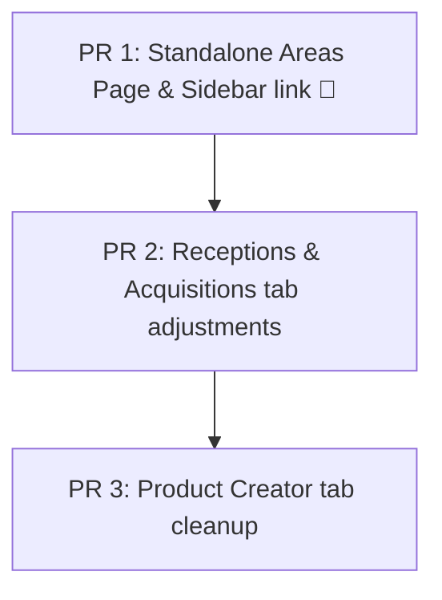

# Tasks: UI Restructuring (reestructuracion-ui)

## Review Workload Forecast

- **Chained PRs recommended**: Yes
- **400-line budget risk**: Medium
- **Delivery strategy**: auto-chain
- **Chain strategy**: stacked-to-main
- **Decision needed before apply**: No

### Dependency Diagram & PR Slices

- **PR 1: Standalone Areas Page & Sidebar link** (Est: ~200 lines)
- **PR 2: Receptions & Acquisitions tab adjustments** (Est: ~300 lines)
- **PR 3: Product Creator tab cleanup** (Est: ~100 lines)

---

## Tasks

### Phase 1: Standalone Areas Page Implementation (PR 1)
- [x] Create standalone Areas page at [frontend/src/pages/areas/index.tsx](file:///home/vdev/desarrollo/Inventariomarzo-final/frontend/src/pages/areas/index.tsx) by migrating `creador-productos/areas-tab.tsx`.
- [x] Add route guarding for admin only using `useAuthStore` and `<Navigate to="/" replace />`.
- [x] Implement page layout with `<h1 className="t-h1">Áreas</h1>` and description, without `useFullWidthPage()`.
- [x] Register lazy import and route `<Route path="/areas" element={<AreasPage />} />` inside `<Route element={<AppLayout />}>` in [frontend/src/App.tsx](file:///home/vdev/desarrollo/Inventariomarzo-final/frontend/src/App.tsx).
- [x] Add sidebar link under the "Sistema" group in [frontend/src/components/layout/sidebar.tsx](file:///home/vdev/desarrollo/Inventariomarzo-final/frontend/src/components/layout/sidebar.tsx) with `{ to: "/areas", icon: Settings, label: "Áreas", adminOnly: true }`.

### Phase 2: Refactoring Recepciones & Acquisitions Pages (PR 2)
- [x] Rename sidebar menu item with path `/ordenes-compra` under `Compras` to `"Adquisiciones"` in [frontend/src/components/layout/sidebar.tsx](file:///home/vdev/desarrollo/Inventariomarzo-final/frontend/src/components/layout/sidebar.tsx).
- [x] Update title in [frontend/src/pages/ordenes-compra/index.tsx](file:///home/vdev/desarrollo/Inventariomarzo-final/frontend/src/pages/ordenes-compra/index.tsx) to `"Adquisiciones"`.
- [x] Rename the Acquisitions tab "Solicitudes de Compra Respaldadas" to "Órdenes de Compra" in [frontend/src/pages/ordenes-compra/index.tsx](file:///home/vdev/desarrollo/Inventariomarzo-final/frontend/src/pages/ordenes-compra/index.tsx).
- [x] Remove "Guías de Despacho Respaldadas" tab/gallery, associated states, queries (`guias` query, search input, paginations, modal states), and unused gallery imports from [frontend/src/pages/ordenes-compra/index.tsx](file:///home/vdev/desarrollo/Inventariomarzo-final/frontend/src/pages/ordenes-compra/index.tsx).
- [x] Add `{ key: "guias", label: "Guías Respaldadas" }` to tabs list and `guias` to `TabActivo` union type in [frontend/src/pages/recepciones/index.tsx](file:///home/vdev/desarrollo/Inventariomarzo-final/frontend/src/pages/recepciones/index.tsx).
- [x] Implement search input debouncing, gallery list query (`guias-respaldadas`), and pagination states in [frontend/src/pages/recepciones/index.tsx](file:///home/vdev/desarrollo/Inventariomarzo-final/frontend/src/pages/recepciones/index.tsx).
- [x] Render gallery list UI, search filters, and download/lightbox modal when `tabActivo === "guias"`, and hide standard filters in [frontend/src/pages/recepciones/index.tsx](file:///home/vdev/desarrollo/Inventariomarzo-final/frontend/src/pages/recepciones/index.tsx).

### Phase 3: Cleaning up Creador de Productos Tabs (PR 3)
- [x] Rename tab `presentaciones` label from `"Presentaciones"` to `"Formatos de Empaque"` in [frontend/src/pages/creador-productos/index.tsx](file:///home/vdev/desarrollo/Inventariomarzo-final/frontend/src/pages/creador-productos/index.tsx).
- [x] Remove `areas` and `gtins` tabs from `TABS` array and `TabId` union type in [frontend/src/pages/creador-productos/index.tsx](file:///home/vdev/desarrollo/Inventariomarzo-final/frontend/src/pages/creador-productos/index.tsx).
- [x] Remove imports of `AreasTab` and `GtinsTab` components, and Lucide icons `MapPin` and `Barcode` from [frontend/src/pages/creador-productos/index.tsx](file:///home/vdev/desarrollo/Inventariomarzo-final/frontend/src/pages/creador-productos/index.tsx).
- [x] Remove conditional tab content rendering for `areas` and `gtins` in [frontend/src/pages/creador-productos/index.tsx](file:///home/vdev/desarrollo/Inventariomarzo-final/frontend/src/pages/creador-productos/index.tsx).

### Phase 4: Verification and Manual Testing
- [x] Verify non-admin users are blocked from `/areas` and redirected to `/`.
- [x] Verify admin users can access `/areas` and CRUD inventory areas.
- [x] Verify sidebar displays renamed link "Adquisiciones" and new link "Áreas" for admin.
- [x] Verify Creador de Productos does not show "GTINs" or "Áreas" tabs, and "Presentaciones" is renamed to "Formatos de Empaque".
- [x] Verify Adquisiciones page lists orders directly without the gallery tab.
- [x] Verify Recepciones page displays "Guías Respaldadas" gallery with working search, pagination, and lightbox.
