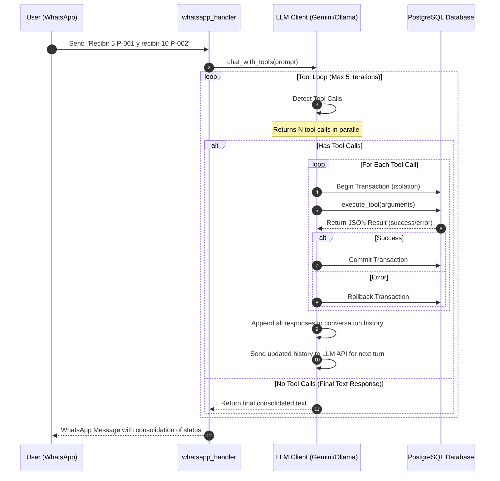
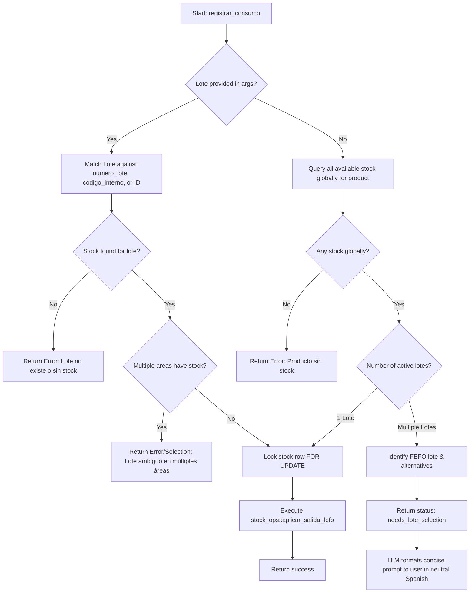

# Technical Specification: Multiple Transactions & Global Stock Consumption in WhatsApp Agent

This specification details the technical architecture, data contracts, and logical flows required to enable parallel tool execution, global stock querying and consumption for technologists, and an interactive hybrid FEFO consumption flow in the WhatsApp Agent.

---

## Quick Path for Implementers

1. **Implement Tool Execution Loop Fix**: Modify `chat_with_tools` in `backend/src/services/llm.rs` to process all tool calls in parallel for both `GeminiClient` and `OllamaClient`, gathering all outputs before replying to the model.
2. **Add `registrar_consumo` Tool**: Implement `execute_registrar_consumo` in `backend/src/handlers/whatsapp.rs` and expose its schemas in `llm.rs`.
3. **Apply RBAC & Locking**: Enable `tecnologo` global access in `execute_buscar_stock` and `execute_registrar_consumo`, and secure stock modifications using `FOR UPDATE` transaction locks.
4. **Verification**: Run unit and integration tests to verify batch execution, transaction isolation, and user prompt formatting.

---

## Architectural Decisions

| Topic | Decision | Justification |
|-------|----------|---------------|
| **Parallel Execution** | Execute all parallel tool calls returned by the LLM in a single loop iteration. | Prevents loss of user intent when multiple operations (e.g., receiving multiple products) are sent in a single WhatsApp message. |
| **Transaction Isolation** | Execute each tool call in its own standalone transaction block (`pool.begin()`). | Ensures failure isolation: a failure in one operation (e.g., incorrect code for product B) does not roll back a successful operation (e.g., product A). |
| **Technologist RBAC** | Allow `tecnologo` role to bypass the `usuario_area` checks in `buscar_stock` and `registrar_consumo`. | Empowers clinical technologists to query and consume stock globally across all laboratory areas. |
| **Hybrid FEFO Flow** | Automatically consume if a single lote exists; prompt for selection if multiple lotes exist. | Balances UX efficiency (no confirmation noise for unique lotes) with operational accuracy (preventing wrong lote registration for multi-lote stock). |
| **Pessimistic Locking** | Query and lock stock rows using `FOR UPDATE` within the consumption transaction. | Prevents race conditions and double-spending of stock in a concurrent environment. |

---

## Logical Flows & Diagrams

### 1. Parallel Tool Call Execution Loop



### 2. Hybrid FEFO Consumption Flow



---

## Tool Contracts & Schema

### 1. Tool Input Schema (`registrar_consumo`)

#### Gemini Format (JSON Schema)
```json
{
  "name": "registrar_consumo",
  "description": "Registra el consumo de stock de un producto específico. Si no se indica un lote y existen múltiples, el sistema devolverá las opciones disponibles para que el usuario elija.",
  "parameters": {
    "type": "OBJECT",
    "properties": {
      "producto": {
        "type": "STRING",
        "description": "Código interno del producto, código de barras o nombre del producto"
      },
      "cantidad": {
        "type": "NUMBER",
        "description": "Cantidad física a consumir (número positivo, máx 2 decimales)"
      },
      "lote": {
        "type": "STRING",
        "description": "Opcional. Código identificador de lote del fabricante, código interno o UUID del lote"
      },
      "area_id": {
        "type": "INTEGER",
        "description": "Opcional. ID numérico del área donde se realiza el consumo"
      }
    },
    "required": ["producto", "cantidad"]
  }
}
```

#### Ollama/OpenAI Format (JSON Schema)
```json
{
  "type": "function",
  "function": {
    "name": "registrar_consumo",
    "description": "Registra el consumo de stock de un producto específico. Si no se indica un lote y existen múltiples, el sistema devolverá las opciones disponibles para que el usuario elija.",
    "parameters": {
      "type": "object",
      "properties": {
        "producto": {
          "type": "string",
          "description": "Código interno del producto, código de barras o nombre del producto"
        },
        "cantidad": {
          "type": "number",
          "description": "Cantidad física a consumir (número positivo, máx 2 decimales)"
        },
        "lote": {
          "type": "string",
          "description": "Opcional. Código identificador de lote del fabricante, código interno o UUID del lote"
        },
        "area_id": {
          "type": "integer",
          "description": "Opcional. ID numérico del área donde se realiza el consumo"
        }
      },
      "required": ["producto", "cantidad"]
    }
  }
}
```

### 2. Tool Output Schema

#### Case A: Direct Consumption Success (Single Lote Globally or Lote Provided)
```json
{
  "status": "success",
  "message": "Consumo registrado con éxito: se descontaron 5 unidades del Lote L12 (vence: 2026-12-31) en el área Área Central."
}
```

#### Case B: Interactive Lote Selection Required (Multiple Lotes Globally)
```json
{
  "status": "needs_lote_selection",
  "producto_nombre": "Paracetamol 500mg",
  "cantidad": 5.0,
  "fefo_lote": {
    "lote_id": "00000000-0000-0000-0000-000000000001",
    "numero_lote": "L12",
    "codigo_interno": "LT-001",
    "fecha_vencimiento": "2026-08-30",
    "area_nombre": "Área Central",
    "area_id": 1,
    "cantidad_disponible": 10.0
  },
  "alternativas": [
    {
      "lote_id": "00000000-0000-0000-0000-000000000002",
      "numero_lote": "L14",
      "codigo_interno": "LT-002",
      "fecha_vencimiento": "2026-12-31",
      "area_nombre": "Urgencias",
      "area_id": 2,
      "cantidad_disponible": 15.0
    }
  ]
}
```

---

## Rust Implementation Specification

### 1. `backend/src/services/llm.rs` updates

#### Gemini Client Tool Execution Loop
Rewrite the loop's tool handling block to execute multiple tools in parallel:
```rust
// Replace the single function call break check:
let mut function_call_found = false;
let mut function_responses = Vec::new();

for part in &model_content.parts {
    if let Some(ref call) = part.function_call {
        function_call_found = true;
        
        // Match command types and execute tool in isolation
        let cmd_type = match call.name.as_str() {
            "buscar_stock" => "STOCK",
            "registrar_ingreso" => "RECIBIR",
            "registrar_consumo" => "CONSUMO",
            "crear_solicitud_compra" => "CREAR",
            _ => "INVALIDO",
        };
        if cmd_type != "INVALIDO" {
            command_type = Some(cmd_type.to_string());
        }

        // Execute tool (internally runs pool.begin())
        let tool_result = match execute_tool(pool, user, &call.name, call.args.clone()).await {
            Ok(val) => {
                if val.get("status").and_then(|s| s.as_str()) == Some("error") {
                    status = "DB_ERROR".to_string(); // set error code accordingly
                }
                val
            }
            Err(e) => {
                status = "DB_ERROR".to_string();
                serde_json::json!({ "status": "error", "message": e.to_string() })
            }
        };

        function_responses.push(GeminiContentPart {
            text: None,
            function_call: None,
            function_response: Some(GeminiFunctionResponse {
                name: call.name.clone(),
                response: tool_result,
                id: call.id.clone(),
            }),
            thought_signature: None,
        });
    }
}

if function_call_found {
    contents.push(GeminiContent {
        role: "function".to_string(),
        parts: function_responses,
    });
    // continue loop to send function responses back to Gemini
    continue;
}
```

#### Ollama Client Tool Execution Loop
Update the tool execution logic to run all parallel `tool_calls` returned in the chat completion:
```rust
if let Some(ref tool_calls) = model_message.tool_calls {
    if !tool_calls.is_empty() {
        for tool_call in tool_calls {
            let cmd_type = match tool_call.function.name.as_str() {
                "buscar_stock" => "STOCK",
                "registrar_ingreso" => "RECIBIR",
                "registrar_consumo" => "CONSUMO",
                "crear_solicitud_compra" => "CREAR",
                _ => "INVALIDO",
            };
            if cmd_type != "INVALIDO" {
                command_type = Some(cmd_type.to_string());
            }

            let args_val: serde_json::Value = serde_json::from_str(&tool_call.function.arguments)
                .unwrap_or(serde_json::Value::Null);

            let tool_result = match execute_tool(pool, user, &tool_call.function.name, args_val).await {
                Ok(val) => val,
                Err(e) => serde_json::json!({ "status": "error", "message": e.to_string() })
            };

            messages.push(OpenAiMessage {
                role: "tool".to_string(),
                content: Some(serde_json::to_string(&tool_result).unwrap()),
                tool_calls: None,
                tool_call_id: Some(tool_call.id.clone()),
            });
        }
        continue; // continue loop to send tool results to Ollama
    }
}
```

### 2. `backend/src/handlers/whatsapp.rs` updates

#### Struct Definitions
```rust
#[derive(Debug, Deserialize, Serialize, Clone)]
pub struct RegistrarConsumoArgs {
    pub producto: String,
    pub cantidad: rust_decimal::Decimal,
    pub lote: Option<String>,
    pub area_id: Option<i32>,
}

#[derive(Debug, Serialize, Deserialize, Clone)]
pub struct RegistrarConsumoResult {
    pub status: String,
    pub message: String,
}

#[derive(Debug, Serialize, Deserialize, Clone)]
pub struct LoteSelectionDetail {
    pub lote_id: uuid::Uuid,
    pub numero_lote: String,
    pub codigo_interno: String,
    pub fecha_vencimiento: chrono::NaiveDate,
    pub area_nombre: String,
    pub area_id: i32,
    pub cantidad_disponible: rust_decimal::Decimal,
}
```

#### `execute_registrar_consumo` Logic
1. **RBAC Control**: Validate `user.rol` is `"admin"` or `"tecnologo"`. Return `"error"` status if unauthorized.
2. **Input Validation**: Check that `cantidad` is $> 0$ and does not exceed two decimal places.
3. **Product Resolution**: Resolve name/code using `resolve_product(pool, &args.producto)`.
4. **Lote Decision Tree**:
   - **Case 1: No `lote` parameter is provided**:
     - Query database for all available stock for the resolved `producto_id` globally, sorted by `fecha_vencimiento ASC`.
     - If no stock matches, return: `{"status": "error", "message": "Error: No hay stock disponible para este producto."}`.
     - If **exactly 1 stock row** is returned:
       - Process consumption immediately using that lote and area. Start transaction, select and lock stock row `FOR UPDATE`, apply consumption via `stock_ops::aplicar_salida_fefo`, commit, and return success payload.
     - If **multiple stock rows** are returned:
       - Construct the `needs_lote_selection` payload. Set `fefo_lote` to the first record, and map the rest to `alternativas`. Return this JSON directly without inserting any movements.
   - **Case 2: `lote` parameter is provided**:
     - Query the specific lote matching `args.lote` (identifying it via `numero_lote`, `codigo_interno`, or `id`).
     - If `area_id` is specified, filter by it. If not, verify if the lote is stored in multiple areas. If multiple, return an ambiguity error. If exactly one, select its `area_id`.
     - Start transaction, lock the row for update:
       ```sql
       SELECT cantidad FROM stock WHERE lote_id = $1 AND area_id = $2 FOR UPDATE
       ```
     - Validate quantity availability. If insufficient, return an error.
     - Call `stock_ops::aplicar_salida_fefo`, commit transaction, and return success payload.

---

## LLM System Prompt Updates (Neutral Spanish)

To guide the LLM on how to present the interactive consumption choices and maintain a professional voice, append the following guidelines to `get_system_prompt()`:

```markdown
REGLAS PARA EL CONSUMO DE INVENTARIO ('registrar_consumo'):
1. Solo los roles 'admin' y 'tecnologo' tienen autorización para registrar consumos. Estos usuarios tienen acceso global (pueden buscar y consumir stock en cualquier área).
2. Si el backend responde con estado "success", confirma inmediatamente la transacción al usuario indicando el lote y área utilizados.
3. Si el backend responde con estado "needs_lote_selection", debes formularle al usuario la siguiente pregunta de selección de lote en español neutro estricto, utilizando los datos recibidos en el JSON:
   "Voy a registrar el consumo de [CANTIDAD] unidades del Lote [LOTE_SUGERIDO] (vence pronto: [FECHA_VENCIMIENTO]) en el área [AREA_SUGERIDA]. ¿Confirmas? (Si usaste otro lote, dime el código o número: [LOTE_ALT1], [LOTE_ALT2], etc.)"
4. Si el usuario responde confirmando (ej. "Sí", "Confirmar"), llama a 'registrar_consumo' pasando el lote y el area_id sugerido.
5. Si el usuario indica que utilizó uno de los lotes alternativos (ej. "Usé el lote L14"), llama a 'registrar_consumo' pasando el lote y el area_id correspondiente a esa alternativa.
```

---

## Verification & Acceptance Checklist

- [ ] **Parallel Executions**: A single WhatsApp message containing multiple transaction commands (e.g. "Recibir 5 de P-001 y recibir 10 de P-002") executes all commands successfully within the same webhook turn.
- [ ] **Transaction Isolation**: In a batch of 2 transactions where the first succeeds and the second fails (e.g., due to insufficient stock or invalid barcode), the first transaction commits successfully and the second rolls back, reporting both outcomes to the user.
- [ ] **Global Technologist Access**: A user with the `tecnologo` role is allowed to search stock globally and consume stock across all areas. The area for consumption is automatically inferred from the selected lote's physical location.
- [ ] **Interactive Hybrid FEFO Selection**:
  - Consuming a product with only one active lote completes immediately without confirmation.
  - Consuming a product with multiple active lotes prompts the user with the correct Spanish format.
- [ ] **Data Safety**: All db changes are executed within transactions using `FOR UPDATE` row-level locks on the `stock` table.
- [ ] **Language Consistency**: The system prompt and LLM outputs strictly adhere to professional neutral Spanish ("español neutro").
